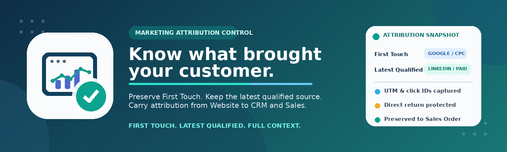
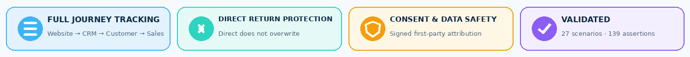

First & Last Touch Attribution for Odoo
=======================================

Never lose the marketing source behind a customer.

A prospect may first arrive from Google Ads, return later through Direct traffic,
and convert only after another campaign. First & Last Touch Attribution keeps
the acquisition story clear instead of letting the final visit hide the source
that actually brought the prospect.

The module preserves one stable First Touch and one Latest Qualified Acquisition
with UTM data, landing page, external referrer, supported advertising click IDs,
and timestamps. That context follows the normal Odoo flow from Website forms to
CRM, a newly created customer, and quotations or Sales Orders created from the
Opportunity. No external attribution SaaS or mandatory API is required.

Documentation
-------------

Detailed documentation is included in the ``doc`` folder:

* `Complete User and Administrator Guide <doc/1.%20Complete%20User%20and%20Administrator%20Guide.pdf>`_
  — installation, attribution concepts, daily use, consent behavior, CRM and
  Sales workflow, troubleshooting, and administration.
* `Technical Architecture and Operations Guide <doc/2.%20Technical%20Architecture%20and%20Operations%20Guide.pdf>`_
  — Website capture, signed first-party state, consent lifecycle, attribution
  rules, CRM merge behavior, customer and Sales propagation, security, and
  operational details.
* `Testing, Acceptance, and Go-Live Guide <doc/3.%20Testing%20Acceptance%20and%20Go-Live%20Guide.pdf>`_
  — automated checks, browser validation, acceptance scenarios, regression
  coverage, rollout, and go-live verification.

The guides are written for business users, administrators, implementation
specialists, and technical support teams. They provide the step-by-step detail
needed to understand, operate, validate, and support the module independently.

Full Technical Implementation and Testing Report
------------------------------------------------

The complete case study explains the standard Odoo UTM, Website Form, CRM,
customer, Sales, and cookie-consent architecture used by the module. It covers
First Touch and Latest Qualified Acquisition rules, atomic snapshots, click-ID
handling, signed browser state, multi-Website protection, CRM merge behavior,
customer and Sales propagation, copy safety, access control, and final
validation.

The completed QA includes 27 functional and technical scenarios, 139 deep
server-side assertions, nine Python/HttpCase tests, two Hoot JavaScript tests,
and a real browser end-to-end flow from optional-cookie consent to signed
attribution state, standard Website form submission, and the expected CRM
acquisition.

`Read the Full Technical Implementation and Testing Report on Google Drive <https://drive.google.com/file/d/1Z8PI5bj6_TcQ-n-UBsaSyxwwIE6CKrcg/view?usp=drive_link>`_

What the Module Does
--------------------

A conversion rarely tells the whole acquisition story by itself. A prospect can
arrive from Google Ads, return directly days later, visit through LinkedIn, and
only then submit a Contact Us form. If Direct or the last page overwrites the
known campaign, Sales can see the customer but lose the source that created the
opportunity.

``website_first_last_touch`` keeps two clear acquisition points throughout that
journey:

* **First Touch** — the first valid Website entry that the module is allowed to
  observe. It can be UTM, an advertising click, an external referral, or Direct.
  Once stored, it is not replaced by later visits.
* **Latest Qualified Acquisition** — the latest meaningful acquisition that
  contains supported UTM data, a supported advertising click ID, or a valid
  external referrer. Internal navigation and later Direct returns do not replace
  a known qualified source.

Each touch is stored as one complete snapshot. Source, medium, campaign, term,
content, landing page, referrer, click ID, and timestamp stay together instead
of being mixed between different visits. The result is attribution that remains
understandable when the lead becomes a customer and the opportunity becomes a
sale.
